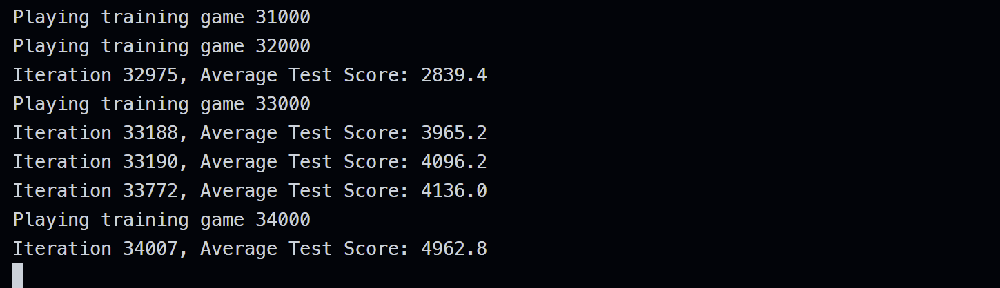

# ZJU-AILesson-Final-Project


信电学院2024年春夏学期李英明老师的人工智能课堂大作业，利用强化学习让AI玩Flappy Bird。

目前我的最佳模型平均分可达4962.8，若降低学习率进行训练，应该还可以更高。




## Usage

Python版本为3.11。

训练模型：

```
python train_ai_or_play.py --train
```

测试模型：

```
python train_ai_or_play.py --no-train
```

记得修改模型路径。

## 说明

现训练时会同步进行测试，以找到当前参数下的最佳迭代次数。若不需要测试可以在q_learning.py的第85行开始注释掉测试代码，可以提高训练速度：

```
# 定期测试
        if (i+1) % 1 == 0:
            avg_score = test_model(player)
            if avg_score > best_avg_score:
                best_avg_score = avg_score
                print(f"Iteration {i+1}, Average Test Score: {avg_score}")
                best_iteration = i + 1
                best_player = pickle.loads(pickle.dumps(player))  # 深拷贝当前最好的模型
```

同时，测试代码部分也关闭了动画渲染，若需要观看AI玩Flappy Bird时的动画，可以在q_learning.py的第342行改变render模式：

```
# 渲染模式为None可以跳过动画，"human"为显示动画
def play(ai, audio_on=False, render_mode=None, use_lidar=False):
```

